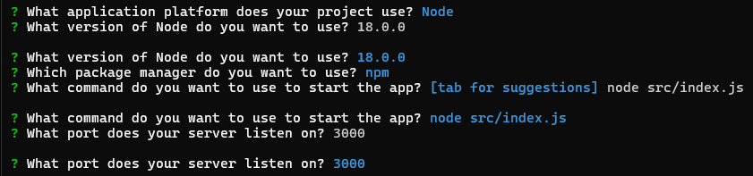
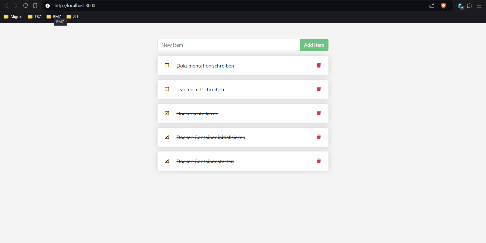

# ToDo-Applikation mit Markdown, Git, GitHub und Docker :whale: 📦
## Installation des Projekts
:link:Link: [GitHub Repository](https://github.com/BenjaminFredericObst/docker-nodejs-sample)

### Klonen des Repositories :desktop_computer: :inbox_tray:

Mit dem Befehl `git clone https://github.com/ICT-BLJ/docker-nodejs-sample.git` kann man das Repository klonen.

### Installation der notwendigen Pakete 📦

Mit dem Befehl `docker init` werden diese Dateien installiert:
- `dockerignore`
- `Dockerfile`
- `compose.yaml`
- `README.Docker.md`

Ausserdem werden mit dem Befehl auch diese wichtigen Pakete installiert, die wichtig für den Betrieb der Applikation sind:
- `express`
- `pg`
- `sqlite3`
- `uuid`
- `wait-port`

Wichtig fürs entwickeln im Docker-Container sind diese Pakete:
- `jest`
- `nodemon`
- `prettier`
Credits: ChatGPT

### Docker-Konfiguration und -Installation :gear: :hammer_and_wrench:

Vor dem Starten muss der Docker-Container noch konfiguriert werden, dass kann man ebenfalls mit diesem Befehl `docker init`.

Einstellungen für den Docker-Container. Mit dem Befehl `docker compose up --build` startet man den Build und die Applikation. 

### Starten der Applikation in einem Docker-Container :rocket:
Mit dem Befehl `docker compose up` startet man die Applikation im Docker-Container und mit dem Befehl `docker compose down` beendet man beides. Um die gestartete Applikation zu bewundern(wenn man alles so eingestellt hat wie oben und wenn es auf der lokalen Maschine läuft), muss man mit dem Browser auf den [Localhost](http://localhost:3000/) zugreifen. 
Wenn man alles richtig gemacht hat, sieht das so aus:

